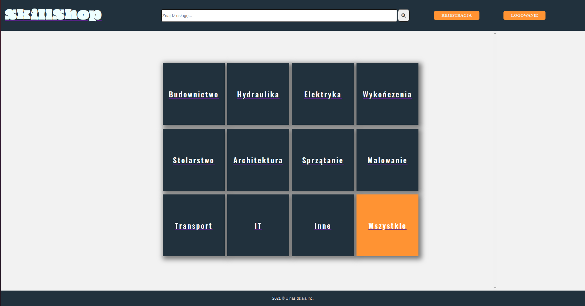
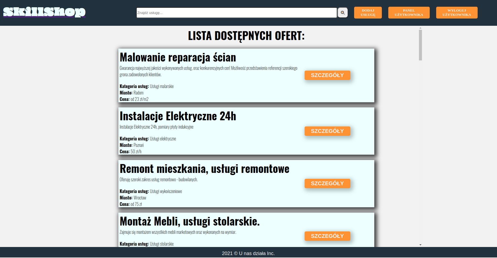

# SkillShop App

SkillShop jest aplikacją stworzoną by umożliwić wykwalifikowanym specjalistom oraz ich klientom szybką i pozbawioną pośredników komunikację. Każdy z zalogowanych użytkowników może nieodpładnie dodać nieograniczoną liczbę ogłoszeń lub skontaktować się z firmami oraz indywidualnymi fachowcami z całej Polski.

## 1. Struktura aplikacji

Projekt SkillShop został utworzony przy pomocy biblioteki React (strona front-endowa) oraz platformy Firebase (strona back-endowa). Na aplikację składają się poniższe komponenty: 
 
-> App 
--> Navbar 
--->SearchBar 
---> SignUpUser 
---> SignIn User 
---> AddService 
---> UserPanel 
----> UserService 
-----> ModifyService 
--> Main 
---> LandingPage 
---> ServiceList 
----> Service 
-----> ServiceDetails 
--> Footer 

<ins>1 App</ins> -  Komponent root'owy, stanowiący kontener dla wszystkich pozostałych. Poza tym są w nim zdefiniowane wszystkie stany (patrz pkt 3) oraz odbywa się w nim pobieranie danych - listy usług przechowywanych za pomocą usługi Cloud Firestore (patrz pkt 2). 

<ins>2 Navbar</ins> - Komponent nagłówka. Zawiera logo (stanowiące również odnośnik, który po kliknięciu przenosi użytkownika do strony startowej aplikacji), pasek umożliwiający wyszukiwanie konkretnych usług oraz przyciski, które po naciśnięciu umożliwiają poruszanie się po głębiej zagęszczonych komponentach aplikacji. Przed zalogowaniem się użytkownik widzi przyciski "Rejestracja" oraz "Logowanie". Tak jak ich nazwy wskazują odsyłają one komponentów umożliwających założenie konta lub autentykację osoby korzystających ze SkillShop. Po zalogowaniu się przyciski "Rejestracja" oraz "Logowanie" znikają, a pojawiają się kolejne: "Dodaj usługę", "Panel Użytkownika" oraz "Wyloguj użytkownika". Ich działanie zostanie opisane poniżej. 

<ins>2.1 SearchBar</ins> - Komponent zawiera input oraz przycisk wyszukania. Po naciśnięciu przycisku użytkownik jest odsyłany do komponentu ServiceList, który wyświetla listę usług pobranych z bazy danych ale przefiltrowanych na podstawie wartości wpisanej w input. 
<ins>2.2 AddService</ins> - Komponent zostaje wyrenderowany po naciśnięciu przycisku "Dodaj usługę". Zawiera szereg inputów odpowiadających za poszczególne pola dokumentu kolekcji "Services" w firebasie (patrz pkt 2). Za każdym razem kiedy dany input jest wypełniany równocześnie update'owany jest stan "form" w komponencie. Stan ten odwzorowuje dokument kolekcji services w Cloud Firestore. Z chwilą naciśnięcia przycisku stan "form" jest przekazywany jako argument do metody "add", która dodaje nowy dokument do ww. kolekcji. 
<ins>2.3 UserPanel</ins> - Wyświetla te usługi które zostały dodane przez zalogowanego obecnie użytkownika. Są one filtrowane na podstawie pola "user" w dokumentach kolekcji.  
<ins>2.3.1 UserService</ins> - Komponent umożliwiający modyfikacje lub usunięcie usługi dodanej przez zalogowanego użytkownika. Zawiera dwa przyciski. Po naciśnięciu przycisku "modyfikuj" renderowany jest komponent "ModifyService". Po naciśnięciu przycisku "usuń" wykonywana jest metoda "delete" usuwająca service z kolekcji na Firebase.  
<ins>2.3.1.1 ModifyService</ins> - Komponent w wyglądzie i działaniu podobny do AddService (w istocie wykorzystujący te same klasy CSS). Jedyna znacząca różnica polega na tym, że po naciśnięciu przycisku wykonywnana jest metoda "update" (zamiast "add"), która modyfikuje istniejące pola dokumentu w Firestore.  

<ins>3. Main</ins> - Komponent, w którym wyświetlana jest większość informacji na stronie. Służy w istocie za kontener dla komponentów LandingPage i ServiceList. Zawiera również znacznik Switch, zawierający route'y dla ww. komponentów.  

<ins>3.1 LandingPage</ins> - Stanowi niejako "stronę startową". Składają się na niego "kafelki", umożliwające po naciśnięciu przeniesienie do komponentu ServiceList z listą usług wyfiltrowaną na podstawie odpowiedniej kategorii.  
<ins>3.2 ServiceList</ins> - Podobnie jak "UserPanel" wyświetla listę usług na podstawie kolekcji Services. Jest widoczny również dla niezalogowanych użytkowników. Usługi mogą zostać wyświetlone wszysktie (bez żadnych filtrów), wyfiltrowane na podstawie kategorii lub na podstawie wartości wpisanej w input komponentu SearchBar. 

<ins>3.2.1 Service</ins> - Komponent zawierający podstawowe informacje dot. danej usługi. Zawiera button "Szczegóły" odsyłający do komponentu ServiceDetails. 
<ins>3.2.1.1 ServiceDetails</ins> Komponent zawierający szczegółowe informacje dot. danej usługi. Zalogowanym użytkownikom umożliwia wyświetlenie danych kontaktowych do osoby, która umieściła ofertę w aplikacji. Niezalogowanych odsyła do okien rejestracji lub logowania. 

<ins>4 Footer</ins> - Stopka strony aplikacji. 
 
K
k
g
